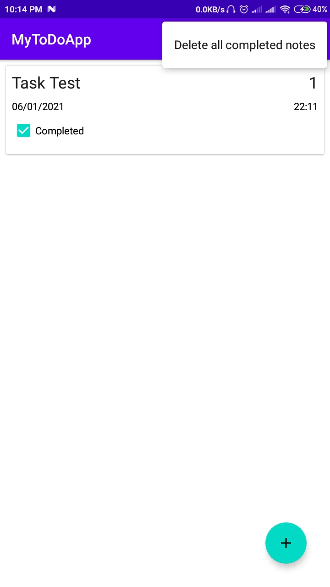

# TodoApp

This app is used in a daily life as reminder for performing a task at a particular time.
 
# Introduction

The app helps user in their daily life to keep track or remind them of important tasks or schedule a reminder. The app can also be used as reminder for small things. The app is developed using MVVM design patterns. The app uses recycler view to show the list of task in dashboard. The app also uses fragment in main activity. The application uses sqlite to store datas which does not need extra database application. The app also gives notification at a scheduled time and date. The app allows editing and deleting task as well through click and swipe.

 
# Architecture
<b>Android Architecture components</b> are a collection of libraries that help you design robust, testable, and maintainable apps with more power over lifecycle management and data persistence. The architecture that was used to develop the application is MVVM which is shown below.

 1. <b><u>Model</u></b> is the data layer of your app. It abstracts the data source.
 2. <b><u>View</u></b> contains the UI of your app. Most often it’s implemented as an Activity or Fragment. View informs ViewModel of user interactions and displays results         received from the ViewModel. View should be lightweight and contain zero to very little business logic.
 3. <b><u>ViewModel</u></b> serves as a bridge between your View and Model. It works with the Model to get and save the data. The View observes and reacts to the data changes exposed by the ViewModel. 
   

 
The model part contains database related class such as DAO, Task Model, Task Database class. The repository class is also related with model but it is the class that helps communicating between Model and View Model class. The viewmodel class provides live data to the View part or UI which basically include activity or fragments.
 
## Features
- Add, Delete, update and Read functionality(CRUD operation) for Todo task.
- Set date and time for notification.
- Swipe Functionality for Deleting of Task.
- Tap for Update of Task.
- Task Details stored in SQLite Database.
- The notification will be shown at the set time and date even when app is closed.

# Get Started

The app can be installed and started easily. The below steps show how to use the app.

  

The first picture show the dashboard that shows all the task. The floating add button gives the second screen shown for adding task. 

  

The select date and select time gives the date and time dialog to set datetime as shown above.

  

The priority can be set by scrolling. The top right icon save the task and set reminder whereas the cross icon closes the activity without saving task. The picture shows 
the task being saved and alarm or reminder set.

  

The above picture shows the notification that was set to show at that time. The task can be updated by tapping on task in dashboard.

  

The above picture shows the task to update being shown and updated easily from the same activity that add it. The task can be set to completed from edit class and there is
menu options to delete all completed task at once.

## License

